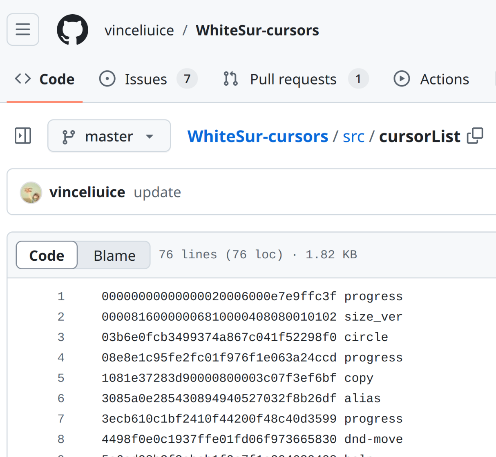

# build-svg-theme: Build your own SVG cursor theme

If you are a cursor theme author, this tool helps you to add support for the [new SVG cursor theme format]((https://blog.vladzahorodnii.com/2024/10/06/svg-cursors-everything-that-you-need-to-know-about-them/)) introduced in KDE Plasma 6.2. If you are a user, you can also use this tool to convert your favorite cursor theme, and make a pull request to the original author.

## Requirements

- Python 3

## Check if your cursor theme is supported by this tool

Take [WhiteSur](https://www.pling.com/p/1411743/) as an example.

1. Find the source code of the cursor theme.


2. It should have a directory with individual SVG files.


3. And a directory with config file.


The config files should look like this:


Note line with "x1/alias.png". The first number "24" in the line is the "nominal size". We will use this number later.

4. And a file listing aliases.


The alias file should look like this:



5. If you have all these files, you can use this tool to build the cursor theme.

## Usage

1. Download this tool.

```bash
git clone https://github.com/jinliu/svg-cursor.git
```

1. Download the source code of the cursor theme.

```bash
git clone https://github.com/vinceliuice/WhiteSur-cursors.git
```

1. Run this tool.

```bash
cd WhiteSur-cursors
../svg-cursor/build-svg-theme/build-svg-theme.py --output-dir=dist/cursors_scalable --svg-dir=src/svg --config-dir=src/config --alias-file=src/cursorList --nominal-size=24
```

1. It's done. You can copy the "cursors_scalable" directory to your cursor theme directory. You might need to select another cursor theme and then switch back to see the changes.
